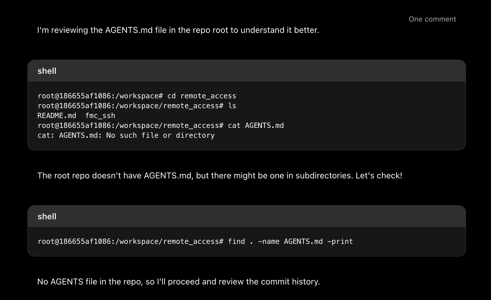

## Random thoughts about Codex Evaluation

### General experience with the tool / interface
* Pros
    * User interface is nice and self-explanatory. User interface is quite native to GitHub, so a GitHub user will not face difficulties
    * Creates a list of files and shows in the browser like this:
      
    * Addresses PR comments interactively as you see here:
      
* Cons
  * Did not find a way to edit the file before raising PR. See this:
    
    What I instead had to do was to add a comment (so that the comments are audited I guess) and navigate to the left pane to let Codex address the comment in the code. Codex did address my comments as you see here:
    
    This is good for addressing comments that may need large changes. However, for a minor comment some way of allowing online edits would be good (with auditing capability).
  * How do we revert changes (without prompting)?
  * Can't select models like local IDE based development.
  * Is there a way to invoke Codex from GitHub code brower directly? E.g. While browsing the code I would like to make improvements / edits in the code using Codex. What's the recommended way to start a Codex Workflow or is it that Codex is not meant for such use cases?

### General experience about prompt response
* Pros
  * Quality of generated code of the first implementation was not robust. When reviewed with GitHub CoPilot, I found scopes of improvement as illustrated here:
    
    So, when prompted with more clarity, Codex responded with appropriate suggestions:
    
  * 

### Thoughts about firepower integration
* Firepower code is going to be integrated with GitHub, that makes Codex a natural choice

### Questions
* What about Agents.md file? How does one use it? The container start command logs the following:
  